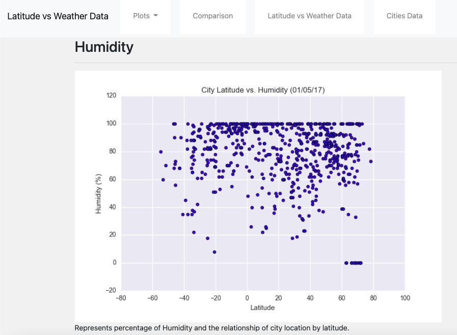

# Web_Design

https://abednarz210.github.io/Web_Design/

## Create a website that includes:

### A landing page containing:

The purpose of this project was to analyze weather changes in respect to the location data to the equator. The analysis was achieved by pulling data from the 
OpenWeatherApi to create datasets for over 500 cities. After the datasets were compiled MatplotLib was used to plot the vaious relationships of Latitude versus 
Temperature, Humidity, Cloudiness, and Wind Speed.

### Four visualization pages, each with:

* A descriptive title and heading tag.
* The plot/visualization itself for the selected comparison.
* A description of the plot and its significance.

### A "Comparisons" page that:

* Contains all of the visualizations on the same page to visually compare them.
* Use Bootstrap for the visualizations.

### A "Data" page that:

* Displays a responsive table containing the data used in the visualizations.
* The table must be a bootstrap table component.
* The data must come from exporting the .csv file as HTML, or converting it to HTML. 
